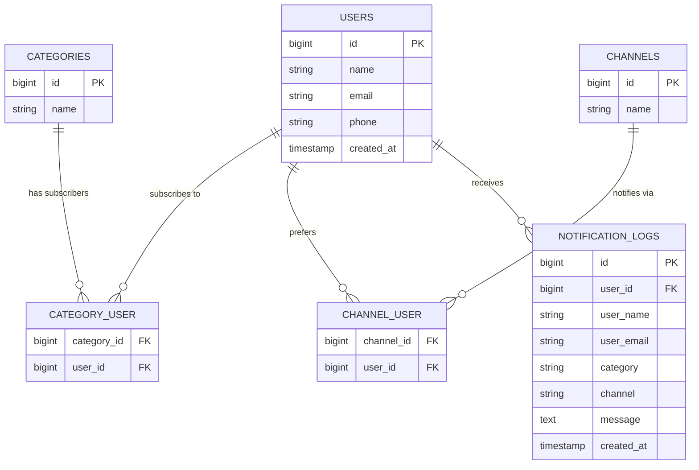

# Architecture & Data Models

## Entity Relationship Diagram

## Notification Flow (Pub-Sub)

1. **API Ingestion:** Message received via POST `/api/notifications`.
2. **Event Dispatch:** `MessageReceived` event is fired.
3. **Subscriber Discovery:** Listener fetches users matching the category.
4. **Strategy Execution:** For each user, the system identifies preferred channels and executes the corresponding Strategy (`SmsProvider`, `EmailProvider`, `PushProvider`).
5. **Persistence:** Every attempt is logged in `notification_logs`.
6. **Real-time Update:** Success events are broadcasted via Laravel Reverb to the frontend log history.
