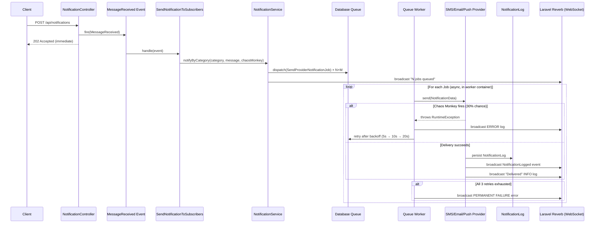
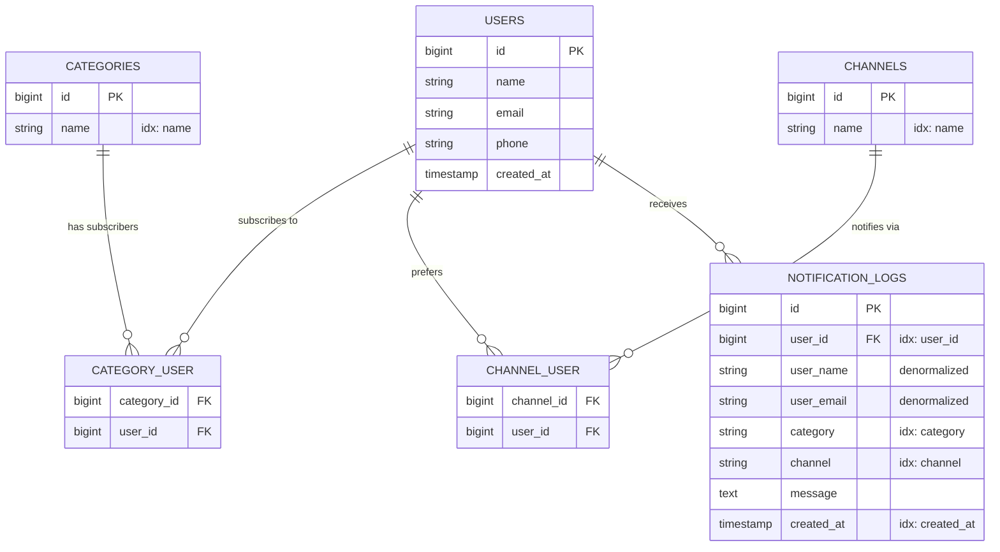

# Architecture & Data Models

## System Overview

EscoffieNews uses an **event-driven, asynchronous** architecture. The HTTP request returns immediately after queuing background jobs — delivery, retries, and failure handling all happen in a separate container.

## Notification Flow



## Entity Relationship Diagram



> **Why denormalize `user_name` and `user_email`?** Log integrity. If a user is later updated or deleted, the historical log still reflects the exact data at delivery time.

## Folder Structure

```
app/
├── Contracts/
│   └── Repositories/          # Interfaces (Repository Pattern)
├── DTOs/
│   └── NotificationData.php   # Typed data transfer object
├── Events/
│   ├── MessageReceived.php
│   ├── NotificationLogged.php
│   └── SystemLogBroadcast.php
├── Http/Controllers/Api/      # Thin controllers, no business logic
├── Jobs/
│   └── SendProviderNotificationJob.php  # Queue job with retry logic
├── Listeners/
│   └── SendNotificationToSubscribers.php
├── Models/
├── Notifications/Channels/
│   ├── Contracts/
│   │   └── NotificationProviderInterface.php  # Strategy contract
│   ├── AbstractNotificationProvider.php       # Shared delivery logic
│   ├── SmsProvider.php
│   ├── EmailProvider.php
│   └── PushProvider.php
├── Providers/
│   └── NotificationServiceProvider.php  # Wires providers into container
├── Repositories/Eloquent/     # Concrete repository implementations
└── Services/
    └── NotificationService.php  # Orchestrates queue dispatch
```

## Adding a New Notification Channel

The Strategy Pattern makes this a minimal change:

1. Create `app/Notifications/Channels/SlackProvider.php` implementing `NotificationProviderInterface`.
2. Add one line to `NotificationServiceProvider::register()`:
   ```php
   $this->app->tag([..., SlackProvider::class], 'notification.providers');
   $service->addProvider($app->make(SlackProvider::class));
   ```
3. Done. The job resolution, retry logic, and logging are all inherited automatically.
