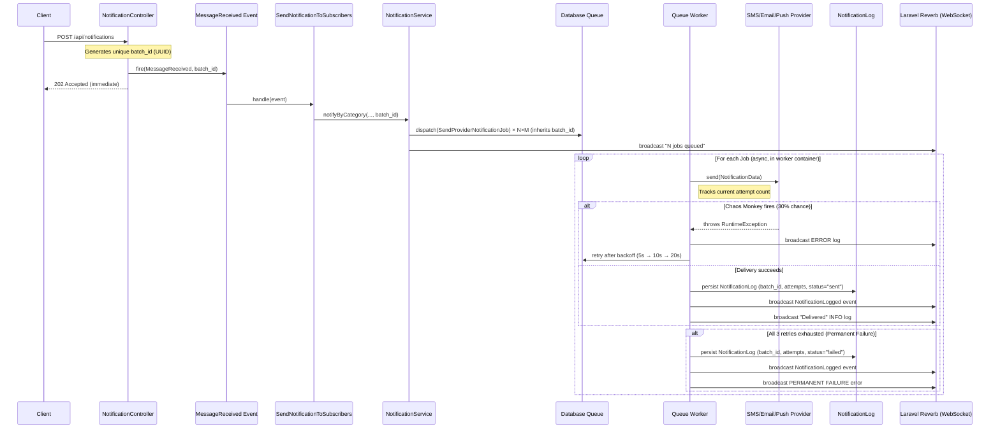
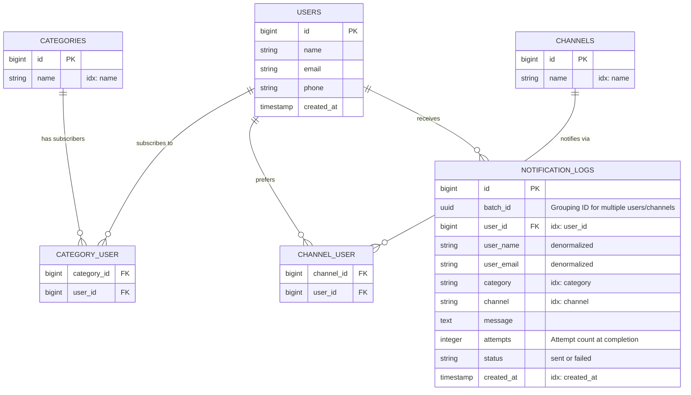

# Architecture & Data Models

## System Overview

EscoffieNews uses an **event-driven, asynchronous** architecture. The HTTP request returns immediately after queuing background jobs — delivery, retries, and failure handling all happen in a separate container.

## Notification Flow



## Entity Relationship Diagram



> **Why denormalize `user_name` and `user_email`?** Log integrity. If a user is later updated or deleted, the historical log still reflects the exact data at delivery time.

## Key Patterns & Responsibility

- **Repository Pattern**: `UserRepositoryInterface` and `NotificationLogRepositoryInterface` encapsulate all Eloquent logic. This allows for clean unit testing and easy maintenance. For example, the `clearAllLogs()` capability was added to the repository layer to handle history management without polluting the controller.
- **Strategy Pattern**: Notification delivery is abstracted via `NotificationProviderInterface`, allowing the system to scale to new channels (Slack, Teams, etc.) by simply adding a new class.

## Observability & Traceability

To ensure end-to-end visibility of asynchronous operations, the system implements a **Batch Traceability Pattern**:

1.  **Unique Batch Identity**: Every notification request generates a unique `batch_id` (UUID) at the API entry point (`NotificationController`).
2.  **DTO Propagation**: This ID is injected into the `NotificationData` DTO and propagated through the queue.
3.  **Attempt Counters**: The `SendProviderNotificationJob` tracks the exact attempt count using Laravel's `$job->attempts()` and persists it to the database.
4.  **Permanent Failure Logging**: Unlike standard queue behavior where failed jobs simply disappear into a failed-jobs table, this system logs a historical entry with `status="failed"` when retries are exhausted, allowing the frontend to show red alerts for undelivered messages.
5.  **UI Grouping**: The frontend uses the `batch_id` to visually group related notifications, allowing users to see exactly which users/channels were part of a single broadcast.

## Folder Structure

```
app/
├── Contracts/
│   └── Repositories/          # Interfaces (Repository Pattern)
├── DTOs/
│   └── NotificationData.php   # Typed data transfer object
├── Events/
│   ├── MessageReceived.php
│   ├── NotificationLogged.php
│   └── SystemLogBroadcast.php
├── Http/Controllers/Api/      # Thin controllers, no business logic
├── Jobs/
│   └── SendProviderNotificationJob.php  # Queue job with retry logic
├── Listeners/
│   └── SendNotificationToSubscribers.php
├── Models/
├── Notifications/Channels/
│   ├── Contracts/
│   │   └── NotificationProviderInterface.php  # Strategy contract
│   ├── AbstractNotificationProvider.php       # Shared delivery logic
│   ├── SmsProvider.php
│   ├── EmailProvider.php
│   └── PushProvider.php
├── Providers/
│   └── NotificationServiceProvider.php  # Wires providers into container
├── Repositories/Eloquent/     # Concrete repository implementations
└── Services/
    └── NotificationService.php  # Orchestrates queue dispatch
```

## Security & Authentication

The system implements a **Simple Admin Authentication** layer to protect the dashboard and API endpoints:

1.  **Token-Based Middleware**: All `/api` routes are protected by the `AdminAuthMiddleware`. It validates an `Authorization` header against the `ADMIN_TOKEN` defined in the environment.
2.  **Frontend Auth Gate**: The React application uses a conditional rendering pattern (`App.jsx`) to show a `LoginPage` if no valid token is found in `localStorage`.
3.  **Axios Interceptor**: Outgoing API requests automatically inject the stored token into the `Authorization` header via a request interceptor in `lib/api.js`.
4.  **Automatic Test Authentication**: The base `TestCase.php` is configured to inject the correct token into all test requests by default, ensuring high developer velocity while maintaining security.

## Adding a New Notification Channel

The Strategy Pattern makes this a minimal change:

1. Create `app/Notifications/Channels/SlackProvider.php` implementing `NotificationProviderInterface`.
2. Add one line to `NotificationServiceProvider::register()`:
   ```php
   $this->app->tag([..., SlackProvider::class], 'notification.providers');
   $service->addProvider($app->make(SlackProvider::class));
   ```
3. Done. The job resolution, retry logic, and logging are all inherited automatically.
